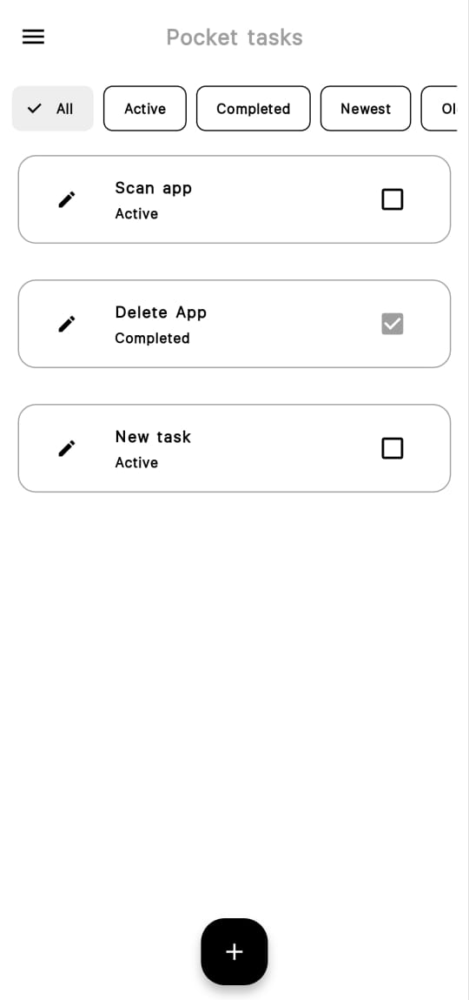
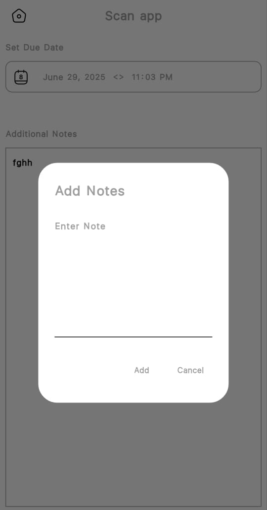
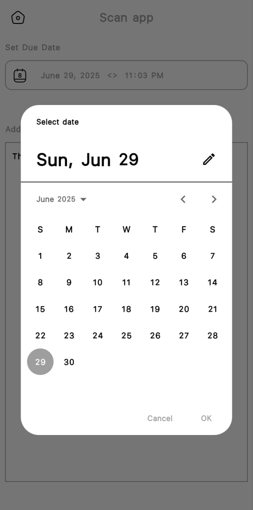

# Pocket Tasks

## Overview
Pocket Tasks is a Flutter-based personal task manager built for offline use. It helps users create, edit, and complete tasks, store task notes, set due dates, and use light/dark themes with local persistence via Hive.

This project is optimized for quick task capture and daily planning, with a clean UI and simple navigation.

## Key Features
- Add, update, and delete tasks
- Mark tasks as completed using a checkbox
- View task details and add/edit notes
- Set a due date for each task
- Filter tasks by: All, Active, Completed, Newest, Oldest
- Persistent local storage with Hive
- Light and dark theme toggle in Settings
- Drawer navigation with Home and Settings screens

## App Structure
- `lib/main.dart`: App entry point, Hive initialization, and provider setup
- `lib/view/home_screen.dart`: Main task list and filtering UI
- `lib/view/task_detail_screen.dart`: Task detail screen with due date and note editing
- `lib/view/my_settings.dart`: Settings screen with theme toggle
- `lib/widgets/my_drawer.dart`: Drawer navigation
- `lib/model/state_mgt/taskProvider.dart`: Provider-based state management
- `lib/model/data/database.dart`: Hive-backed task storage logic
- `lib/model/data/taskdatabase.dart`: Task model and Hive adapter
- `lib/model/data/sub_tasksdatabase.dart`: Subtask note model (present in the data model)
- `lib/model/theme_mode/theme_Provider.dart`: Theme state management

## Architecture
Pocket Tasks uses a simple MVC-like structure with Provider for state management and Hive for local persistence.

- UI components live in `lib/view` and `lib/widgets`
- Data models and Hive logic live in `lib/model/data`
- App state is managed in `lib/model/state_mgt`
- Theme control lives in `lib/model/theme_mode`

## Dependencies
- Flutter SDK
- provider
- hive
- hive_flutter
- path_provider
- google_fonts
- iconsax
- http

## Getting Started
### Prerequisites
- Flutter SDK installed
- Android Studio, VS Code, or another IDE configured for Flutter development
- Device or emulator ready to run the app

### Run the App
```bash
git clone <https://github.com/Adenonso/pocket_tasks>
cd pocket_tasks
flutter pub get
flutter run
```

## Usage
### Home Screen
- Tap the plus button to add a new task
- Use chips to filter tasks by status and order
- Tap a task to open the detail screen
- Long press a task to delete it
- Use the checkbox to mark a task complete



### Task Detail Screen
- Set or change the due date using the date picker
- Tap the note card to add a new note
- Long press the note card to edit the existing note





### Settings
- Enable or disable dark mode

## Data Storage
Tasks are stored locally using Hive in the `taskBox` box. Each task is backed by the `Taskdatabase` model and includes:
- Title
- Notes
- Completion state
- Creation / due date
- An optional list of subtask notes via `SubTasksdatabase`

## Tests
The repository includes basic Flutter tests for core UI and model behavior:
- `test/home_screen_test.dart`
- `test/my_drawer_test.dart`
- `test/taskdatabase_test.dart`
- `test/theme_provider_test.dart`

## Future Improvements
- Add search functionality
- Add notification/reminder support
- Implement true subtask UI support
- Add Google Calendar or cloud sync integrations
- Add more robust unit and widget tests


## Author
Daniel Balogun

## Contact
- Email: balogundaniel06@gmail.com
- GitHub: https://github.com/Adenonso
- LinkedIn: [Daniel Balogun](https://www.linkedin.com/in/daniel-balogun-22380a222?utm_source=share&utm_campaign=share_via&utm_content=profile&utm_medium=android_app)

## Notes
- The current implementation is offline-first and does not include external API or calendar integrations.
- The `SubTasksdatabase` model is available in the data layer but not fully surfaced in the UI yet.

